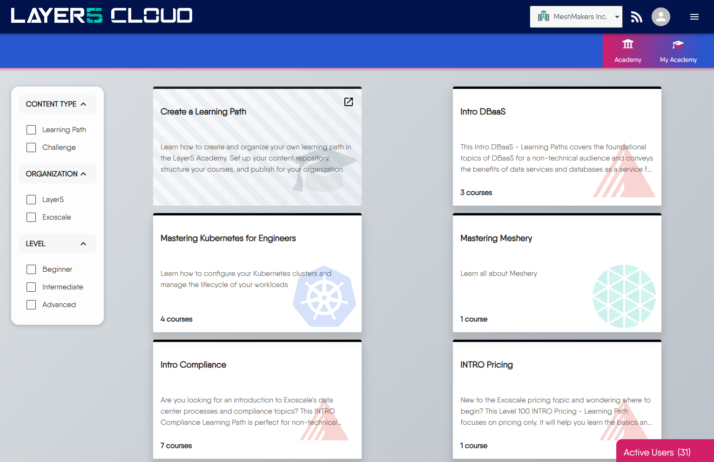

The [Layer5 Cloud Academy](https://cloud.layer5.io/academy) is a modular learning management system (LMS) designed for building learning paths and interactive, hands-on challenges. It is deeply integrated into the Layer5 cloud ecosystem and **[Kanvas](https://kanvas.new/)** — a visual designer for cloud native infrastructure. This integration allows you to embed live visualizations, interactive designs, and contextual experiences directly into your courses.

This approach transforms learning from passive reading into active, hands-on practice.



### Who Can Create Content

The ability to create, manage, and publish content is available to organizations on our **Enterprise Plan**. This plan includes full support for:

  - **Multi-tenancy:** Your content, users, and data are securely isolated from all other organizations.
  - **White-labeling:** You can brand the Academy with your own logo and color scheme.
  - **Customization:** You have complete control over the learning paths and challenges you create.

> You can learn more about our subscription plans on the [Layer5 Pricing](https://layer5.io/pricing) page.

### Content Creation Process

We believe you should always own your content. That’s why the Academy is designed around a Git-native workflow that avoids vendor lock-in.

Instead of using a restrictive web UI, you manage all your learning content within **your own Git repositories**. This gives you the full power of version control, collaboration through pull requests, and a workflow that your developers are already comfortable with. 

The entire experience is powered by **[Hugo](https://gohugo.io/)**, a powerful static site engine, but we've abstracted away the complexity. You and your team only need to write in simple Markdown.


You don't need to be a web developer to create beautiful and effective learning content. The provided theme handles all the layouts, styling, and complex components, letting you focus solely on the quality of your material.


### Organizing Your Learning Paths

Your content is structured hierarchically to create a clear and logical learning experience for your users.

At the highest level, you have a **Learning Path**, which contains one or more **Courses**. Each Course is broken down into **Modules**, and each Module consists of individual learning activities like **Pages** (for text) and **Labs** (for hands-on practice). In addition, **Tests** can be integrated at various levels of this hierarchy. This modular structure makes your content easy to navigate, manage, and update.

For example, a **Learning Path** named **"Mastering Kubernetes"** might contain:
  * A **Course** on **"Core Concepts"**, which is broken down into multiple modules:
      * **Module 1: "Workload Fundamentals"**, containing a **Page** on the "Anatomy of a Pod" and a hands-on **Lab** for "Scaling Deployments".
      * **Module 2: "Networking Principles"**, containing a **Page** that covers "Services and Ingress" and a **Tests** on networking concepts.


To ensure security and isolation, all of your content files must be placed within a directory named for your organization UUID. You'll learn the specifics of how to do this in our [hands-on tutorial](/cloud/academy/creating-your-learning-path/).


### Advanced Content Features

Create custom Hugo shortcodes, mix HTML with Markdown, and add custom CSS styling to enhance your Academy content.

#### Content Format Support

The Academy platform supports **Markdown + HTML mixing** and **custom CSS styling**.

##### HTML + Markdown Integration

Combine Markdown syntax with HTML elements in the same file:

```markdown
## Markdown Heading

This is **bold** text in markdown.

<div style="background: #000000ff; padding: 20px;">
  <h3>HTML Section</h3>
  <p>This is HTML with **markdown** inside.</p>
</div>
```

##### Custom CSS Support

The platform supports CSS through multiple methods:

1. **Inline CSS** (as shown above)
2. **CSS in shortcodes** (demonstrated below)
3. **CSS classes** in HTML elements


This example demonstrates custom CSS styling within the Academy platform. The styling includes custom colors, padding, borders, and typography.


##### Verification Steps

To verify these capabilities work in your Academy content:

1. **Test HTML + Markdown mixing**: Copy the example above into any `.md` file in your Academy content
2. **Test CSS styling**: Use the `styled-callout` shortcode as shown
3. **Preview locally**: Run `make site` to see the rendered result
4. **Production verification**: Deploy to staging to confirm compatibility


When properly rendered, you will see:
- Markdown formatting (bold, italic, links) processed within HTML elements
- Custom CSS styles applied (colors, spacing, borders)
- Seamless integration without layout conflicts
- Responsive behavior across different screen sizes

#### Creating Custom Shortcodes

Custom shortcodes are reusable components that enhance Academy content. They function as templates that accept parameters and generate HTML output.

##### Basic Shortcode

**Step 1:** Create the shortcode file in your organization's directory:
```
layouts/shortcodes/<your-organization-uuid>/custom-org-shortcode.html
```

**Step 2:** Define the shortcode template:
```html
{{ $names := .Get "names" }}
<div class="custom shortcode">
  {{ $names }}
 Hey! This is a custom shortcode
</div>
```

**Step 3:** Use the shortcode in your content:
```markdown

```

**How it works:**
- `{{ .Get "names" }}` retrieves the "names" parameter
- The shortcode outputs: "Alex, Bob, Charely Hey! This is a custom shortcode"
- You can reuse this shortcode throughout your Academy content

##### Shortcode with CSS

Add CSS styling to make shortcodes visually appealing.

**Example:** `layouts/shortcodes/<your-org-uuid>/styled-callout.html`
```html
<style>
.custom-callout { 
  padding: 1rem; 
  margin: 1rem 0; 
  border-radius: 4px; 
  border-left: 4px solid #007bff;
  background: #f8f9fa;
}
</style>
<div class="custom-callout">
  <strong>{{ .Get "title" | default "Note" }}:</strong> {{ .Inner }}
</div>
```

**Usage:**
```markdown

This is a styled callout with custom CSS.

```

**Result:**

This is a styled callout with custom CSS.


**How CSS works in shortcodes:**
- `<style>` tags define the visual appearance
- `.custom-callout` creates a CSS class for styling
- The shortcode applies padding, margins, colors, and borders
- `{{ .Inner }}` displays the content between opening and closing shortcode tags